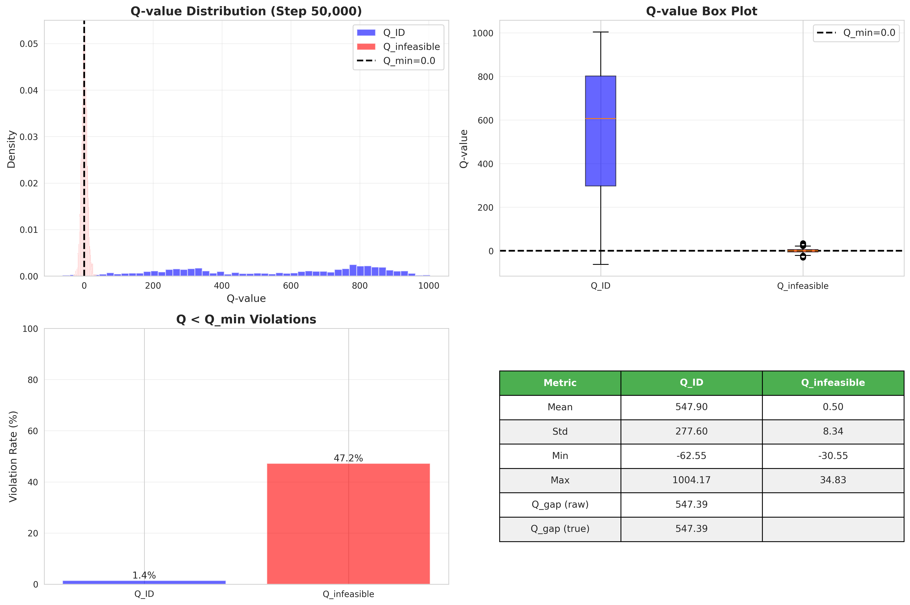

## Base
This implementation is built on top of [Penalizing Infeasible Actions and Reward Scaling in Reinforcement Learning with Offline Data](https://arxiv.org/abs/2507.08761)

### TODO
[d3rlpy TD3+BC algo](https://github.com/takuseno/d3rlpy/blob/master/d3rlpy/algos/qlearning/td3_plus_bc.py)와 성능비교

## Results (antmaze-umaze-v0)

  
   
  <b>(a)</b> Learning curve (50k) &nbsp;&nbsp;&nbsp; <b>(b)</b> Learning curve (150k)

  
   
  <b>(c)</b> Q distribution (50k) &nbsp;&nbsp;&nbsp; <b>(d)</b> Q distribution (150k)

