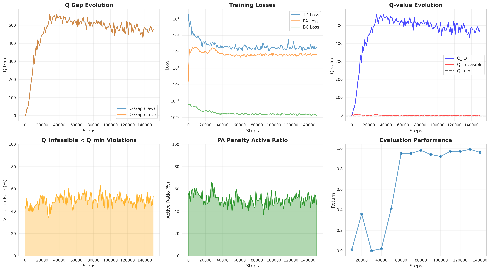

# ACFQL & PARS Analysis for Offline-to-Online RL

This repository investigates **trajectory-level priority sampling** and **PARS-style infeasible action penalization** in **offline-to-online reinforcement learning**, with a particular focus on **when and why value-side regularization can become redundant or harmful under strong policy priors**.

Our analysis is centered on **ACFQL (Action-Chunked Flow Q-Learning)** in **robomimic manipulation tasks**, and contrasts its behavior with **AntMaze-style sparse-reward environments**, where PARS was originally shown to be effective.

---

## Base

This implementation is built on top of:

- **Penalizing Infeasible Actions and Reward Scaling in Reinforcement Learning with Offline Data (PARS)**  
  https://arxiv.org/abs/2507.08761

- **Action Chunking with Flow Q-Learning (ACFQL)**

While PARS was originally proposed to mitigate Q-value overestimation caused by OOD actions in sparse-reward navigation tasks (e.g., AntMaze), this repository explores **whether the same value-side penalization remains appropriate when the policy already possesses a strong behavior prior**, as in ACFQL.

---

## Motivation

In **offline-to-online RL**, Q-learning often becomes unstable due to:

- extrapolation to out-of-distribution (OOD) actions,
- compounding Bellman errors in long-horizon tasks,
- misalignment between offline data support and online policy.

PARS addresses these issues by:
- explicitly defining *infeasible actions*,
- penalizing their Q-values relative to in-distribution actions,
- enforcing a conservative Q-geometry.

However, **ACFQL already imposes a strong policy prior** via:
- behavior cloning flow matching,
- distillation from multi-step flow rollouts,
- implicit manifold constraints in action space.

This raises a key research question:

> **Is value-side infeasible action penalization still beneficial when policy-side regularization is already strong?**

---

## Key Observation

### ❗ PARS improves AntMaze performance but degrades ACFQL performance on robomimic

Empirically, we observe that:

- In **AntMaze**:
  - clear separation between feasible and infeasible actions,
  - high Q-gap between in-distribution and infeasible actions,
  - PARS stabilizes learning and improves returns.

- In **robomimic + ACFQL**:
  - the dataset consists almost entirely of successful expert trajectories,
  - infeasible actions are *synthetically sampled* and not environment-aligned,
  - Q-values are already well-controlled by the policy prior,
  - PARS introduces **over-regularization and scale conflicts**.

As a result:
- success rate **decreases** when PARS is naively applied,
- despite Q-geometry appearing “well-shaped” by PARS metrics.

---

## Results

### AntMaze (reference behavior)

  
   
  <b>(a)</b> Learning curve (50k) &nbsp;&nbsp;&nbsp; <b>(b)</b> Learning curve (150k)

  
   
  <b>(c)</b> Q distribution (50k) &nbsp;&nbsp;&nbsp; <b>(d)</b> Q distribution (150k)

Observations:
- clear Q-value separation between in-distribution and infeasible actions (dataset-aligned infeasible),
- low violation rate of `Q_infeasible < Q_min`,
- PARS penalty aligns with environment-level infeasibility.

---

### Robomimic + ACFQL (this work)

  
   
  <b>(a)</b> Q-Distribution (50k) &nbsp;&nbsp;&nbsp; <b>(b)</b> Learning curve (150k)

  
   
  <b>(c)</b> Seperation/Gap (50k) &nbsp;&nbsp;&nbsp; <b>(d)</b> Success rate

Observations:
- `Q_ID` grows large due to long-horizon expert returns,
- `Q_infeasible` remains near zero by construction,
- violation rate is high(but also high variance) but **does not correlate with task failure**,
- PARS penalty is frequently active without improving decision quality,
- baseline ACFQL **outperforms ACFQL + PARS** success rate is lower than original ACFQL baseline.

---

## Analysis: Why PARS Fails in Robomimic + ACFQL

Identified two non-exclusive failure modes:

### 1️⃣ Dataset–Infeasible Misalignment

- Robomimic datasets consist almost entirely of *successful expert demonstrations*.
- Synthetic infeasible actions do not correspond to:
  - physically impossible actions,
  - task-level failure modes,
  - or behaviorally meaningful negatives.
- Penalizing these actions distorts the value landscape without improving policy decisions.

---

### 2️⃣ Regularization Redundancy & Conflict

- ACFQL already constrains action generation via:
  - flow-based BC,
  - multi-step rollout distillation,
  - implicit support matching.
- PARS applies an additional **value-side constraint** that:
  - duplicates conservatism already enforced by the policy,
  - introduces scale conflicts in Q-learning targets,
  - reduces useful gradient signal.

In this regime, **PARS suppresses learning signal rather than stabilizing it**.

---

## Ablation Plan

We plan to report the following ablations:

| Method | Purpose |
|------|--------|
| ACFQL (baseline) | strong policy prior |
| ACFQL + PARS (naive infeasible) | show failure case |
| ACFQL + PARS (dataset-aligned infeasible) | test misalignment hypothesis |
| ACFQL + PARS (deconflicted / staged) | test redundancy hypothesis |
| TD3+BC + PARS | confirm PARS works without strong policy priors |

---

## Takeaway

> **PARS is not universally beneficial.  
> When policy priors are strong, value-side infeasible penalization can be redundant or harmful.**

Rather than proposing a new SOTA algorithm, this work aims to clarify:

- **when infeasible action penalization is necessary**,  
- **when it is redundant**, and  
- **how policy- and value-side regularization interact in offline-to-online RL**.

---

## TODO

- [ ] Compare with d3rlpy TD3+BC + PARS  
  https://github.com/takuseno/d3rlpy/blob/master/d3rlpy/algos/qlearning/td3_plus_bc.py
- [ ] Implement dataset-aligned infeasible sampling
- [ ] Add staged PARS activation schedule
- [ ] Add detailed Q-geometry diagnostics

